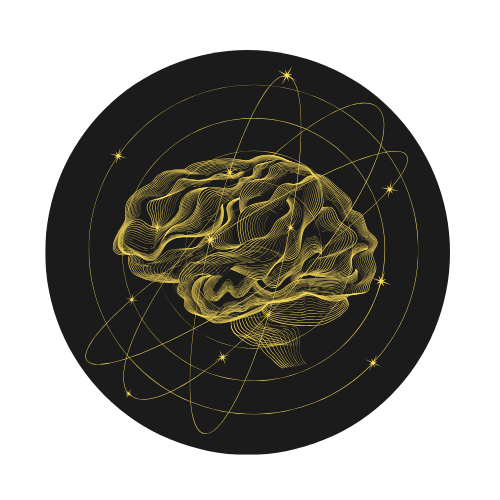

## 📚 **Brainy News**  

  

---

### 🌟 **Project Description**  
**Brainy News** is a modern and responsive news application built with React and Material-UI. It allows users to explore news summaries, view detailed articles, and stay updated with highlighted banners.

---

### 🚀 **Features**  

- 📰 **Dynamic News Cards**: View news summaries with images, titles, and short descriptions.  
- 🎯 **Highlighted News Banners**: Display important news using interactive banners.  
- ⚡ **Responsive Design**: Seamless experience across desktop and mobile devices.  
- 🔗 **React Router**: Navigate to detailed news pages with ease.  
- 🎨 **Material-UI Integration**: Modern UI components and styling.  

---

### 🛠️ **Tech Stack**  

- **Frontend**: React, React Router, Material-UI  
- **Styling**: Material-UI, React-Slick (for banners)  
- **Dependencies**:  
   - `@mui/material`  
   - `react-router-dom`  
   - `react-slick`  

---

### 📸 **Screenshots**  
WIP

---

### ⚙️ **Installation**  

1. **Clone the Repository**:  
   ```bash
   git clone https://github.com/your-username/brainy-news.git
   cd brainy-news
   ```

2. **Install Dependencies**:  
   ```bash
   yarn install
   ```

3. **Run the Project**:  
   ```bash
   yarn start
   ```

4. Open [http://localhost:3000](http://localhost:3000) to view it in the browser.
---

### 🌐 **Live Demo**  
Coming Soon! 🚧  

---

### 🤝 **Contributing**  

Contributions are welcome!  
1. Fork the repository.  
2. Create a new branch: `git checkout -b feature/your-feature-name`.  
3. Commit your changes: `git commit -m "Add your feature"`.  
4. Push to the branch: `git push origin feature/your-feature-name`.  
5. Submit a pull request.  

---

### 📬 **Contact**  

If you have any questions or suggestions, feel free to reach out:  
- 📧 **Email**: Khoshfekr2001@protonmail.com  
---

🚀 **Stay Informed. Stay Brainy.** 🧠  

---

### 🔖 **Credits**  
Built with ❤️ using **React** and **Material-UI**.  
